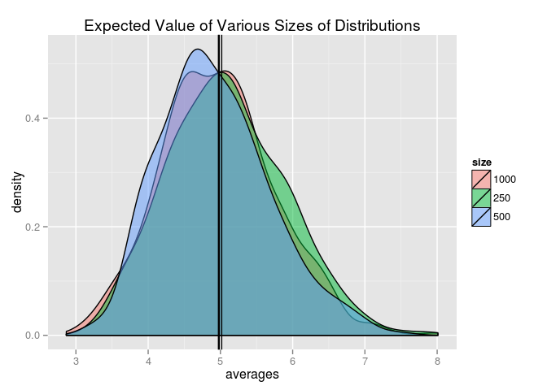

# Statistical Inference Course Project: Exploring the Central Limit Theorem
By Matthew Sedlar  


## Overview

This report explores the Central Limit Theorem using a set of randomly generated exponentials. It will look at the sample mean and how it relates to the theoretical mean as well as the sample variance and the overall distribution.

## Simulations

Let's start by setting the number of simulations we want to run as well as the number of exponentials and rate for each simulation.


```r
nosims <- 1000
nexps <- 40
rate <- 0.2
```

I'm going to run 1,000 simulations on the exponentials using R's replicate function. I am using the replicate function because it takes up less lines than sapply or apply iterations and it's easier to understand if you're just taking a glance at my script. 

Once I have the simulation results in the form of a matrix, I will store the averages of those results in a data frame along with the number of simulations. This will come in handy later. 


```r
# using set.seed so the results can be replicated
# also, 13 is my lucky number
set.seed(13)

# 1000 simulations on 40 random exponentials
sims <- replicate(nosims,rexp(nexps,rate))

# storing the means of those simulations in a data frame
# with the size of the simulations
simsdf <- data.frame(averages = apply(sims,2, mean),
                     size = "1000")
```

Let's plot the averages using ggplot's histogram function to get a sense of our distribution.


```r
library(ggplot2)

ggplot(simsdf, aes(averages)) + 
  geom_histogram() +
  ggtitle("Distribution of Averages from Simulations of Random Exponentials")
```

 

## Sample Mean versus Theoretical Mean.

Let's examine the mean of our sample distribution:


```r
samplemean <- mean(simsdf$averages)
samplemean
```

```
## [1] 4.972512
```

And plot it on the distribution, looking at the density.


```r
ggplot(simsdf, aes(averages)) + 
  geom_density(aes(fill=size),alpha=.5) +
  geom_vline(xintercept= samplemean) +
  ggtitle("Sample Mean on Distribution of Averages")
```

 

We know given the rate (0.2) that our expected value is 5 based on the following formula.

$$E[X]=\frac{1}{\lambda}=\beta$$

We also know that from the Central Limit Theorem that the sample mean approximates the population mean. To illustrate this, I'm going to pull samples from my simulation and plot those against the simulation distribution. 


```r
set.seed(14)
# simulate 500 and 250 averages from random exponentials
asample <- replicate(500,mean(rexp(nexps,rate)))
set.seed(15)
anothersample <- replicate(250,mean(rexp(nexps,rate)))

# creating a new data frame and then binding those rows to the original
sampledf <- data.frame(averages=c(asample,anothersample), size=c("500","250"))
simsdf <- rbind(simsdf,sampledf)

# plotting all the distributions with their means
ggplot(simsdf, aes(averages)) + 
  geom_density(aes(fill=size),alpha=.5) +
  geom_vline(xintercept= c(samplemean, mean(asample), mean(anothersample))) +
  ggtitle("Expected Value of Various Sizes of Distributions")
```

 

No matter the sample size, the sample mean clusters around the theoretical mean. With an infinite number of simulations, we would reach 5.

## Sample Variance versus Theoretical Variance: 

Next, let's look at our sample variance.

We know that our theoretical variance is 25 based on the following formula for an exponential distribution:

$$Var[X]=\frac{1}{\lambda^2}$$

We can find our sample variance by simply squaring the mean.


```r
samplevariance <- samplemean^2
samplevariance
```

```
## [1] 24.72587
```

As with the mean, we see the same behavior with the various. I will use dplyr's group_by function on my simulations data frame to create a dataframe that only displays the means and variances for each size of distributions.


```r
library(dplyr)
averagesdf <- simsdf %>% 
  group_by(size) %>% 
  summarize(mean = mean(averages)) %>% 
  mutate(var = mean^2) 

averagesdf
```

```
## Source: local data frame [3 x 3]
## 
##   size     mean      var
## 1 1000 4.972512 24.72587
## 2  250 5.086720 25.87472
## 3  500 4.926989 24.27522
```


## Distribution: Via figures and text, explain how one can tell the distribution is approximately normal.
