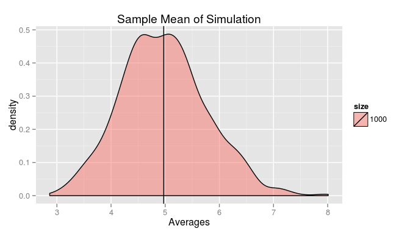

# Statistical Inference Course Project: Exploring the Central Limit Theorem
By Matthew Sedlar  


## Overview

This report explores the Central Limit Theorem using a set of randomly generated exponentials. It will look at the sample mean and how it relates to the theoretical mean, the sample variance and how it relates to the theoretical variance, and whether the resulting distribution approximates normal.

## Simulations


I'm going to run 1,000 simulations on 40 randomly generated exponentials with a rate of 0.2 using R's replicate function. I am using the replicate function because it takes up less lines than sapply or apply iterations and it's easier to understand if you're just taking a glance at my script. 

Once I have the simulation results in the form of a matrix, I will store the averages of those results in a data frame along with the number of simulations. This will come in handy later. 


```r
# using set.seed so the results can be replicated
# also, 13 is my lucky number
set.seed(13)

# 1000 simulations on 40 random exponentials
sims <- replicate(nosims,rexp(nexps,rate))

# storing the means of those simulations in a data frame
# with the size of the simulations
simsdf <- data.frame(averages = apply(sims,2, mean),
                     size = "1000")
```

## Sample Mean versus Theoretical Mean

Let's examine the sample mean of our distribution (See Appendix A for a plot of the distribution).


```
## [1] 4.972512
```

We know given the rate (0.2) that our expected value is 5 based on the following formula.

$$E[X]=\frac{1}{\lambda}=\beta$$

We also know from the Central Limit Theorem that the sample mean from unbiased data approximates the population mean. To illustrate this, I'm going to run two more simulations -- 100 and 10 times, respectively -- and then plot those distributions against the original simulation distribution (see Appendix B for code). 


 

No matter the sample size, the sample mean clusters around the theoretical mean. 

## Sample Variance versus Theoretical Variance 

Next, let's look at our sample variance.

We know that our theoretical variance is 25 because the mean and standard deviation for our exponential distribution is:

$$\frac{1}{\lambda}$$

That makes our variance:

$$Var[X]=\frac{1}{\lambda^2}$$ 

Using that formula, our sample variance is:


```
## [1] 24.72587
```

As with the mean, we see the same behavior with the variance. I will use dplyr's group_by function on my simulations data frame to create a data frame that only displays the means and variances for each size of my simulations (See Appendix C for code).


```
## Source: local data frame [3 x 3]
## 
##   size     mean      var
## 1 1000 4.972512 24.72587
## 2   10 4.784766 22.89398
## 3  100 5.071031 25.71535
```


## Distribution

There are three ways to tell if our distribution is normal. 

* mean = median = mode
* The distribution is symmetric
* 50% of values are less than the mean and 50% are greater
 
Two of these are easy to test.

### mean = median = mode.

In R, this is a simple logical comparison. Since we're trying to prove if it is "approximately" normal, let's use the signif function on our values to the first decimal point. (See Appendix D for code on generating the mode.)


```r
signif(samplemean,1) == signif(median(originalsim$averages),1) 
```

```
## [1] TRUE
```

```r
signif(samplemean,1) == samplemode
```

```
## [1] TRUE
```

By the transitive property of equality, if mean = median and mean = mode, then median= mode. In this case, that is true. 

### 50% of values are less than/above the mean

To find out if our values are split 50/50 at the mean, let's use the qexp function to find the 50th quartile.


```r
qexp(0.50,1/samplemean)
```

```
## [1] 3.446683
```

Uh-oh. If we use the pexp function on our mean, we find our distribution is actually split with 36.7879441% of values occurring above the mean and 63.2120559% of values occuring below. That's hardly symmetric.

We're looking for "approximately" normal, not normal, however. While the distribution does not fit the strict definition of normal, one could argue that because it meets 1/3 of the criteria, it could be considered approximate.

\pagebreak

# Appendix

## Appendix A

 

## Appendix B

### Running Additional Simulations and Adding Results to the Sims Data Frame


```r
# simulate 100 and 10 averages from random exponentials
set.seed(13)
asample <- replicate(nosims/10,mean(rexp(nexps,rate)))
set.seed(13)
anothersample <- replicate(nosims/100,mean(rexp(nexps,rate)))

# creating a new data frame and then binding those rows to the original
sampledf <- data.frame(averages=c(asample,anothersample), size=c("100","10"))
simsdf <- rbind(simsdf,sampledf)
```

## Appendix C

### Data Frame Grouped by Simulation Size with Mean and Variances


```r
library(dplyr)
averagesdf <- simsdf %>% 
  group_by(size) %>% 
  summarize(mean = mean(averages)) %>% 
  mutate(var = mean^2)

averagesdf
```


## Appendix D

### Calculating the Mode


```r
# subsetting the original simulation from my data frame
originalsim <- simsdf %>% filter(size=="1000")

# table of original simulation to find max
table_data <- table(signif(originalsim$averages,1))

# mode of table_data
samplemode <- subset(table_data, table_data==max(table_data))
samplemode <- as.numeric(names(samplemode))
```
